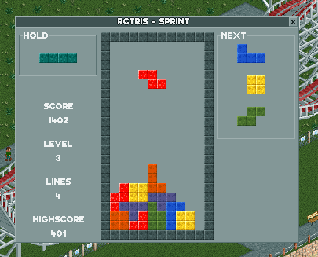

# OpenRCT2 RCTris

An OpenRCT2 plug-in inspired by the gameplay of Tetris (c).

## Installation

1. Make sure that your OpenRCT2 version is up-to-date. You need at least version `0.4.5` or a recent development version.
2. Go to the [releases](https://github.com/Sadret/openrct2-rctris/releases) page and download the `openrct2-rctris-1.0.0.js` file from the latest release. Save it in the `plugin` subfolder of your OpenRCT2 user directory.\
On Windows, this is usually at `C:Users\{User}\Documents\OpenRCT2\plugin`.
3. Start OpenRCT2 and open a scenario. The plug-in can be found in the map menu in the upper toolbar of OpenRCT2.

## Gameplay

Fill the game arena with blocks.
Completely filled lines disappear and increase the score.
More difficult moves and line clears reward more points.
More details can be found for example on [Wikipedia](https://en.wikipedia.org/wiki/Tetris).

## Game Modes

- Sprint: clear 2 lines to level up
- Marathon: clear 10 lines to level up

## Controls

The controls can be changed in OpenRCT2's shortcut settings.
The default keys are:

| Action                  | Key      |
| ----------------------- | -------- |
| Move left               | Numpad 4 |
| Move right              | Numpad 6 |
| Soft drop               | Numpad 5 |
| Hard drop               | Space    |
| Rotate clockwise        | Numpad 8 |
| Rotate counterclockwise | Numpad 7 |
| Hold                    | Numpad 9 |

## Planned Features

- timed game modes
- online multiplayer
- online highscores

Subscribe to my YouTube channel to learn about upcoming features:
[Sadret Gaming](https://www.youtube.com/channel/UCLF2DGVDbo_Od5K4MeGNTRQ/)

## Support Me

If you find any bugs or if you have any ideas for improvements, you can open an issue on GitHub or contact me on Discord: Sadret#2502.

If you like this plug-in, please leave a star on GitHub.

If you really want to support me, you can do this here:
- [Paypal](paypal.me/SadretGaming) (no fees if send to "Friends and Family")
- [Buy me a coffee](https://www.buymeacoffee.com/SadretGaming) (credit card or Link)
- [Ko-fi](https://ko-fi.com/sadret) (credit card or PayPal)
- [GitHub Sponsors](https://github.com/sponsors/Sadret) (credit card)

## Copyright and License

Copyright (c) 2024 Sadret\
The OpenRCT2 plug-in "RCTris" is licensed under the GNU General Public License version 3.\
This plugin uses OpenRCT2-FlexUI by Basssiiie which is licensed under the MIT License.
